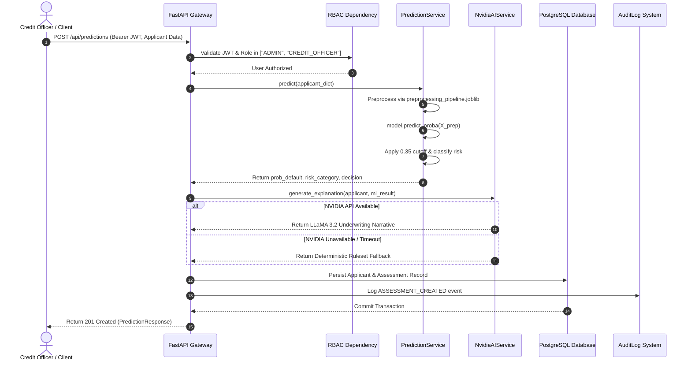

# Smart Credit Risk Platform — Architecture & System Design

## 1. System Overview

The **Smart Credit Risk Platform** is an enterprise-grade decision intelligence system designed for loan risk scoring, explainability, simulation, and regulatory governance.

```
                      React 18 Frontend SPA
           (TypeScript, Vite, Tailwind CSS, Recharts)
                              │
                    HTTPS / JSON-RPC REST
                    (Bearer JWT Authorization)
                              ▼
                      FastAPI Backend Engine
             (Uvicorn ASGI Server, Python 3.11+)
                              │
  ┌───────────────────────────┼───────────────────────────┐
  │                           │                           │
  ▼                           ▼                           ▼
Security & Middleware    Core Routing Layer          Persistence Layer
├── Request Correlation  ├── /api/auth               ├── PostgreSQL 16
│   (X-Request-ID)       ├── /api/predictions        │   (Alembic Migrations)
├── Security Headers     ├── /api/simulate           ├── SQLAlchemy 2.0 ORM
├── CORS Validation      ├── /api/reports            │   (Connection Pooling)
├── Fail-Fast Settings   ├── /api/monitoring         └── SQLite3
└── Structured Errors    ├── /api/governance             (Dev/Testing fallback)
                         ├── /api/admin
                         ├── /api/analytics
                         └── /health & /ready
```

---

## 2. Core Separation of Authority: Local ML vs. Generative AI

The foundational architectural principle of the platform is the **strict separation of prediction authority from generative explainability**:

```
               Applicant Features (20 Origination Attributes)
                                     │
                                     ▼
                ┌────────────────────────────────────────┐
                │        LOCAL CREDIT ML ENGINE          │
                │     (SOLE PREDICTION AUTHORITY)        │
                │                                        │
                │  1. Preprocessing Pipeline             │
                │     • One-Hot Encoding                 │
                │     • Feature Standard Scaling         │
                │                                        │
                │  2. Calibrated Logistic Regression     │
                │     • Predicts P(Default) [0.0 - 1.0]  │
                │                                        │
                │  3. Decision Cutoff Threshold          │
                │     • Locked at 0.35 (Cost-Optimized)  │
                │                                        │
                │  4. Deterministic Risk Category        │
                │     • LOW / MODERATE / HIGH RISK       │
                └───────────────────┬────────────────────┘
                                    │
                         Immutable ML Output
                                    │
                                    ▼
                ┌────────────────────────────────────────┐
                │          NVIDIA AI LAYER               │
                │       (EXPLAINABILITY ONLY)            │
                │                                        │
                │  • Model: LLaMA 3.2 11B Vision Instruct│
                │  • Generates Natural Language Summary  │
                │  • Highlights Primary Risk Drivers     │
                │  • Recommends Underwriting Mitigants   │
                │                                        │
                │  FAILSAFE BOUNDARY:                    │
                │  Cannot alter default probability      │
                │  Cannot alter risk classification      │
                │  Cannot alter decision threshold       │
                │  Deterministic fallback on timeout     │
                └───────────────────┬────────────────────┘
                                    │
                                    ▼
                     Combined Assessment Result
```

### Why This Separation Is Essential
1. **Mathematical Calibrations**: The ML model was calibrated against empirical default outcomes with balanced misclassification cost penalties (misclassifying a defaulter is 5x costlier than misclassifying a good borrower).
2. **Regulatory Compliance**: Adverse Action notices cannot rely on stochastic LLM token outputs. Regulators require auditable, repeatable mathematical reasoning.
3. **Fault Tolerance**: If the external NVIDIA API is unreachable or times out, the platform continues scoring loans without interruption via internal deterministic fallback generation.

---

## 3. Subsystem Architecture

### 3.1 Service Layer Structure

```text
backend/services/
├── prediction_service.py   # Loads final_model.joblib & executes predict_proba
├── nvidia_ai_service.py    # Integrates LLaMA 3.2 11B with fallback ruleset
├── report_service.py       # Two-pass vector PDF report generator
├── monitoring_service.py   # Computes PSI feature drift and prediction metrics
├── governance_service.py   # Verifies checksums, demographic distributions
├── admin_service.py        # User lifecycle, platform diagnostics, audit logs
└── analytics_service.py    # Portfolio KPIs, histograms, risk concentrations
```

### 3.2 Machine Learning Inference Subsystem
- **Authoritative Model**: Tuned Logistic Regression (`C=0.1`, `penalty='l2'`, `class_weight='balanced'`).
- **Artifacts**:
  - `models/final_model.joblib` (SHA-256: `7FCC6EC2B5E481EEA9A6BE007CC7679E28F9ABACAE8D4DBDA19BA5C18EB3C768`)
  - `models/preprocessing_pipeline.joblib` (SHA-256: `8B0BB086C63FDB928E0D5840FB9B29B23A75F638665A86915B17A7E46984288A`)
  - `models/threshold_config.json` (SHA-256: `13FD9163C88B4109B5BFE479898F3D65E40137FABF3BF0A102F2CAA491F94EAC`)
- **Cutoff Threshold**: `0.35`.

### 3.3 What-If Credit Risk Simulator
- **Route**: `POST /api/simulate`
- **Execution Flow**:
  1. Accepts `original_applicant` and `modifications` dictionary.
  2. Applies modifications to an in-memory clone of the applicant dictionary.
  3. Executes ML inference on original and simulated applicants.
  4. Calculates $\Delta P = P_{\text{simulated}} - P_{\text{original}}$ and risk transition.
  5. Computes optional NVIDIA scenario explanation.
  6. **Zero Database Impact**: No assessments or applicant records are saved or updated during simulation.

### 3.4 Automated Reporting Subsystem
- **Engine**: ReportLab Document Engine with custom `NumberedCanvas`.
- **Properties**:
  - Vector PDF layout with running headers and dynamic page numbering.
  - Generates directly from verified database records.
  - Does **not** recalculate predictions or invoke the ML model during report compilation.
  - Sanitized to prevent credential leakage.

---

## 4. End-to-End Prediction Sequence



---

## 5. Security & Reliability Architecture

1. **Authentication**: Stateless HMAC-SHA256 JWT tokens with configurable expiration (60 minutes).
2. **Access Control**: Role-based access control with three distinct operational roles (`ADMIN`, `CREDIT_OFFICER`, `VIEWER`).
3. **Request Tracing**: `correlation_id_middleware` generates or propagates `X-Request-ID` across all transactions.
4. **Defense-in-Depth Headers**: Standard security headers (`nosniff`, `DENY`, `strict-origin-when-cross-origin`, `X-XSS-Protection`).
5. **Fail-Safe Startup**: In production mode, application aborts startup if secrets are weak or CORS is permissive.
6. **Container Reliability**: Dedicated `/health` (liveness) and `/ready` (readiness) probes verifying DB and ML artifact health without running model inference.
